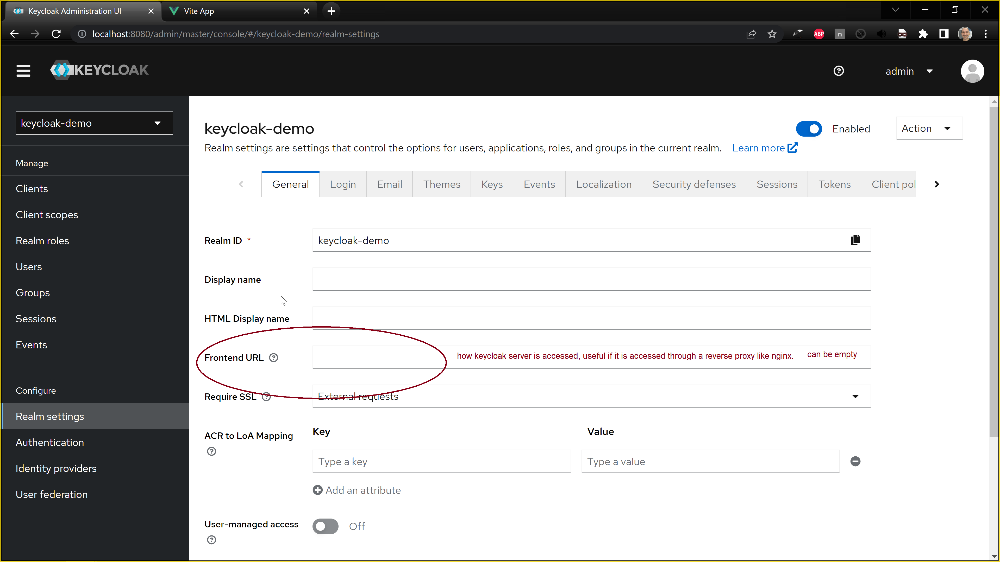
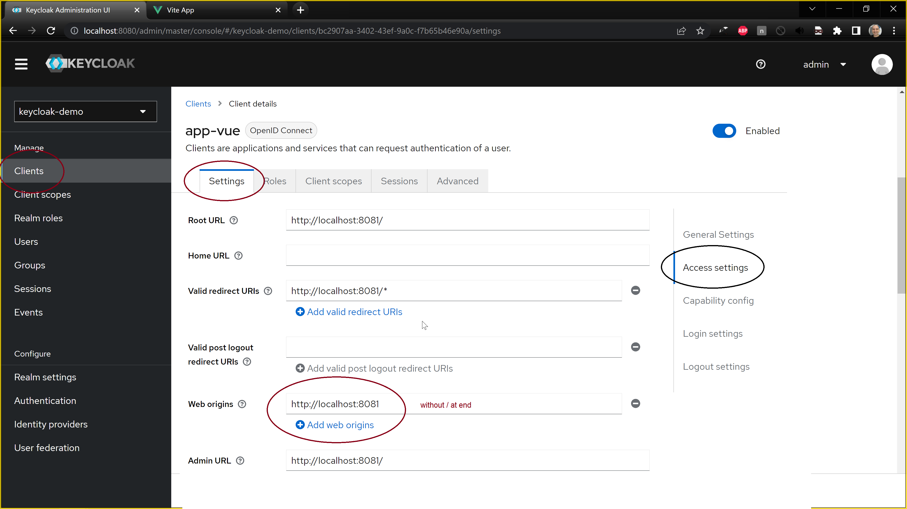
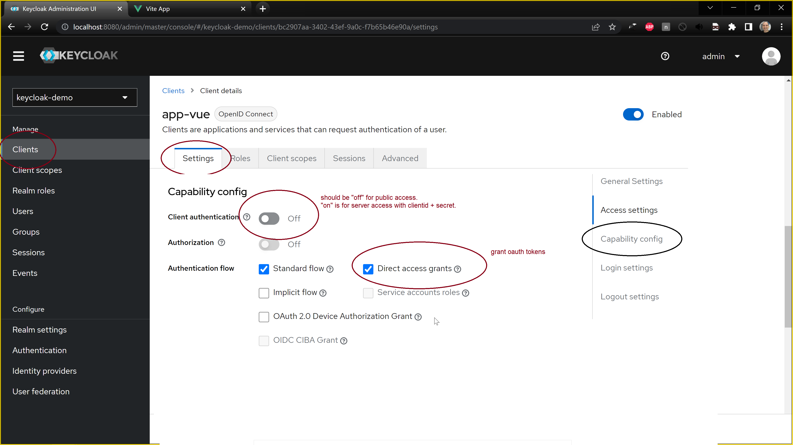
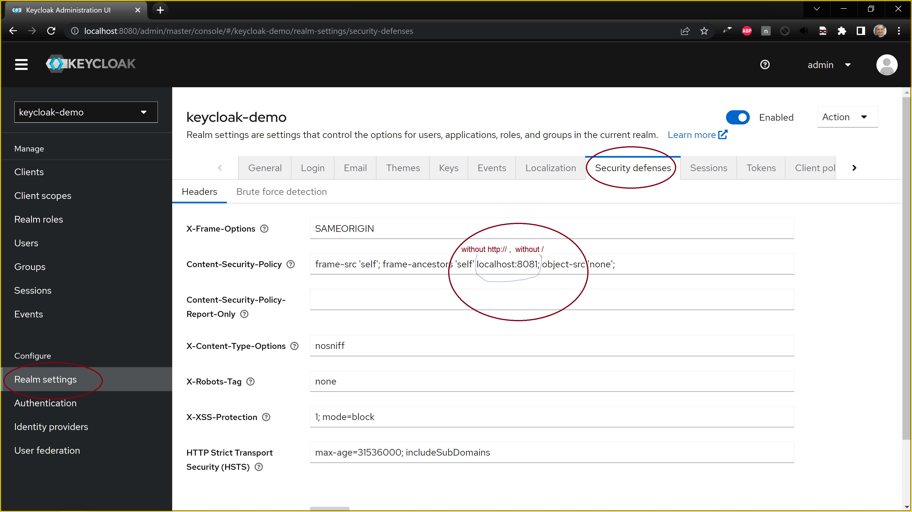
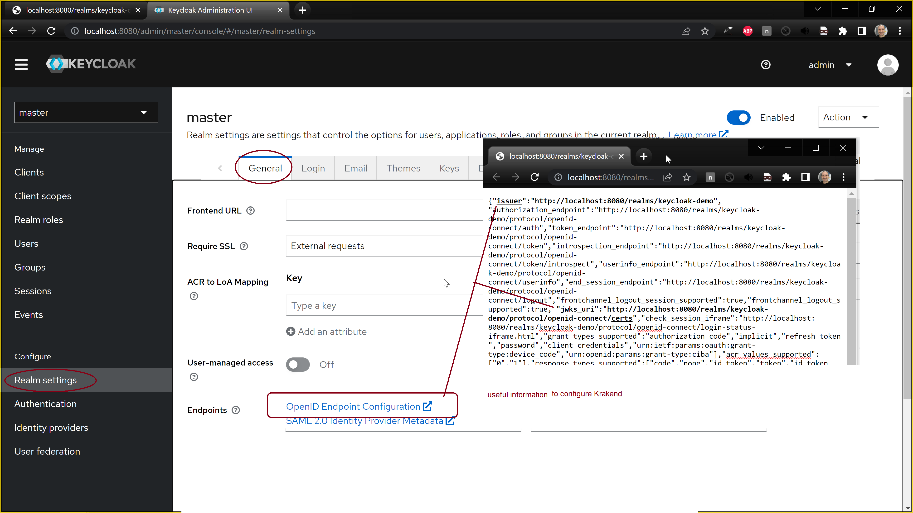

# gettings started configuring keycloak

tl;dr:

 # go to http://localhost:8080/
 # create a realm : keycloak-demo
 # create a client with clientid,: app-vue
 # create a client, page 2: don't change anything (keep Client authentication = Off, Standard flow = 🗹 checked , Direct access grants= 🗹 checked)
 # create a client, page 3
  - Root URL (with / at end): http://localhost:8081/
  - Valid redirect URIs(with /* at end): http://localhost:8081/*
  - Web origins (no / at end): http://localhost:8081
 # in Realm settings, Tab: Security defenses
  - in Content-Security-Policy after frame-ancestors 'self' add app hostname: localhost:8081
  - result is: 
    - frame-src 'self'; frame-ancestors 'self' localhost:8081; object-src 'none';
 # Users
  - Create new user
  - username: user, click create.
  - in Tab: Credenctials, click Set password.
    - password: user
    - confirm password: user
    - temporary: Off
    - click save
    - click again save password

# go to http://localhost:8081/ and login
--

in this tutoreial I will only cover how to overcome cors and content security policy issues.

each time after starting keycloak docker need to configure the Realm. A Realm is a login area.

for the example create a realm named:

keycloak-demo

the demo runs with temporary in memory database. for your production server need to install a production installaction of keycloak with some security, ssl, and presistence, like with a database or user federation.

if keycloak is accessed throught a reverse proxy. need to configure its external url.
in Realm settings> Frontend URL, this url is how keyclock server is accessed from the frontend application. it can be empty for default value.



Each login screen or login interface has a client. a client for keycloak api.
each Client has a client id. 

in Clients, create a client of type OpenID, with clientId:

app-vue

need to configure web application urls.

In editing a client settings> Acceess Settings:
 - Root URL: website url with slash at end
 - valid redirect URIs: website url with /* at end
 - Web origins(CORS): protocol and website domain without slash at end. - to allow accessing keycloack server from websites with this origin.



to make sure the client so it does not require an api-key-secret, it was previously called "Public" mode.

In editing a client settings> Capability config:
 - Client authentication: make sure it is in "Off" state, to allow Public access. (setting the Client authentication to "on" will require ClientId and a Secret, which is usually it is used by server side applications), we only want to use a client id so keep it off.
 - Direct access grants: make sure it is checked, to allow to generate Oauth2 tokens creation.



Realm settings>Security defenses>Content-Security-Policy
add to frame-ancestors only hostname, without http(s):// and slash at end.

```text
frame-src 'self'; frame-ancestors 'self' localhost:8081; object-src 'none';
```


there are some useful valus that will help configure KrakenD authentication validation.

in Realm settings> Endpoints

there is a link "OpenID endpoint configuration".
it is a link to json file.

it is possible to find there  (JWT)Json Web Token. issuer name to validate issuer name in KrakenD, and the "certs" url to to configure token signature validation in KrakenD



Next task is to create a user for the example,

Users-> create
type user in username
in credencials tab> create password
type user in passsword
uncheck temporary password

Next steps could be to enable user registration.
and more customization
